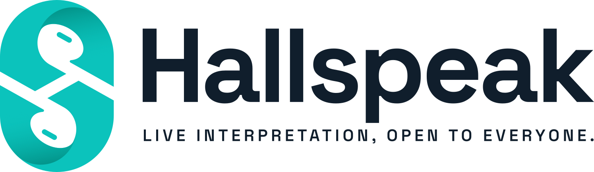

<h1 align="center">
  <a href="https://hallspeak.app">
    <picture>
      <source media="(prefers-color-scheme: dark)" srcset=".github/assets/logo-on-dark.svg">
      
    </picture>
  </a>
</h1>

<p align="center">
  <a href="https://github.com/simon-vajda/hallspeak/releases"></a>
  <a href="https://github.com/simon-vajda/hallspeak/releases"></a>
  <a href="LICENSE"></a>
  <a href="https://hallspeak.app"></a>
</p>

Self-hosted simultaneous interpretation for live, in-person events. An interpreter speaks
into a browser; guests in the room listen on their own phones, in their own language, with
as little delay as the network allows.

It runs happily on a NAS or a home server. You own the whole thing: no cloud services, no
subscription, and no account registration needed for anyone except the admin.

Learn more at **[hallspeak.app](https://hallspeak.app)**.

## How it works

- An **Event** is one occasion — a service, a session, a talk. It has one or more
  **Channels**, in practice one per target language.
- Guests join an Event with its **PIN** (or a QR code carrying it), pick a Channel and
  listen. No sign-up, no app required: the listener works in any modern browser, and a
  native iOS and Android app adds lock-screen controls and smoother background playback.
- Each Channel has its own **Speaker code**. Whoever holds it opens the speaker studio in a
  browser and goes live. Two interpreters sharing a Channel swap through a **handover**
  that neither cuts the other off mid-sentence nor leaves a gap in the audio.
- Listeners can send an anonymous **issue report** (too quiet, too loud, static, noise, silence) that the
  interpreter sees in the studio, alongside the live listener count.
- The **administrator** creates Events and Channels, opens and closes them, and prints
  the links and QR codes.

Possession of a link or code is the whole authorization. Hallspeak never learns who is
listening. [CONCEPTS.md](CONCEPTS.md) defines every term precisely.

## Running it

Hallspeak ships as one Docker image, `ghcr.io/simon-vajda/hallspeak`, which you run behind
a reverse proxy that terminates HTTPS. Audio does not go through the proxy: guests connect
directly to a small range of forwarded ports (44400–44403 by default, UDP and TCP).

In short:

1. Download `compose.yaml` and `.env.example` from the
   [latest release](https://github.com/simon-vajda/hallspeak/releases/latest).
2. Save `.env.example` as `.env` and set `PUBLIC_ADDRESS` to your public hostname or IP.
3. Forward the audio ports on your router and point your reverse proxy at port 3000.
4. Run `docker compose up -d` and open your HTTPS address to create the admin account.

The [operator guide](https://hallspeak.app/getting-started/installation/) covers each
step, proxy configurations for Caddy, nginx and Nginx Proxy Manager, upgrades, and a
troubleshooting table. Read it before your first event: a wrong public address produces a
server where every page loads and nobody hears anything.

## Status

The web admin, speaker studio and listener, the audio pipeline and the mobile listener
are working. The mobile app is not yet published to the App Store or Google Play, and
there is no mobile speaker studio. Interpreters use the browser.

## Development

Requires Node 24 and pnpm (the version is pinned in `package.json`).

```sh
pnpm install
pnpm dev                          # server on :3000, web on :5173
pnpm -F @hallspeak/mobile start   # Metro for the mobile app, separately
```

| Command          | What it does                                                         |
| ---------------- | -------------------------------------------------------------------- |
| `pnpm test`      | Vitest across server, web and shared packages; `jest-expo` in mobile |
| `pnpm typecheck` | Regenerates the OpenAPI contract, then type-checks every package     |
| `pnpm check`     | Biome lint and format check, plus the version check                  |
| `pnpm build`     | Production build of the web app and server                           |

The repository is a pnpm workspace:

| Path                   | Contents                                                          |
| ---------------------- | ----------------------------------------------------------------- |
| `apps/server`          | Hono API, Socket.IO signalling, SQLite via Drizzle, mediasoup SFU |
| `apps/web`             | Vite + React SPA: admin, speaker studio and listener              |
| `apps/mobile`          | Expo + React Native listener app                                  |
| `packages/contract`    | Zod schemas and route definitions shared by server and clients    |
| `packages/client-core` | Platform-free client logic shared by web and mobile               |
| `docs/solutions`       | Write-ups of past problems, filed by area                         |
