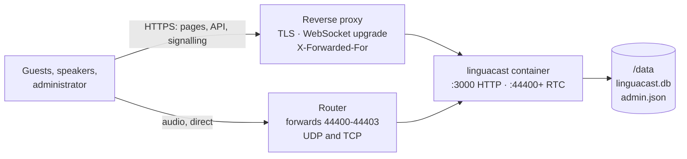

# Hosting LinguaCast

One container, behind a reverse proxy you supply. Files you need: `compose.yaml` and
`env.example`, both attached to the
[latest release](https://github.com/simon-vajda/linguacast/releases/latest). Take them from
the release, not from `main`: `main` can already name a version that has not been published.

## How it fits together

Two paths reach the container, and only one of them goes through your proxy. Almost
every deployment failure is a confusion between them.



- **Pages and signalling** go through the proxy over HTTPS. Without TLS the speaker
  studio cannot open a microphone and signing in fails silently, because the session
  cookie is a `__Host-` cookie the browser discards.
- **Audio never touches the proxy.** It goes straight to the RTC ports, so those must
  be forwarded on your router and published one-to-one — the port a guest dials is the
  port inside the ICE candidate, so remapping it breaks audio while leaving every
  screen looking healthy.
- **`/data` is all of your state.** Back it up; nothing else survives a recreate.

## Prerequisites

- A reverse proxy terminating TLS for a hostname pointing at this server.
- Router forwarding for **44400–44403, UDP and TCP**, to the host running the container —
  one port per CPU core LinguaCast may use, which is four by default.
- A public address stable enough to put in a config file, and a host on Linux kernel 6
  or newer.

## Deploy

Download `compose.yaml` and `env.example` from the
[latest release](https://github.com/simon-vajda/linguacast/releases/latest) into wherever you
keep your Compose stacks, save the second one as `.env`, and set:

- **`PUBLIC_ADDRESS`** — where guests reach this server: your public hostname, usually
  the same one your reverse proxy serves, `linguacast.example.com`. A public IP address
  works too if you have no hostname. The only value you must fill in. Audio connects here
  directly rather than through your proxy, so this must be reachable from the internet on
  the RTC ports even though your proxy already works. A hostname is resolved to an address
  at startup and re-checked every minute, so a home connection whose public IP changes
  keeps working on its own — see [dynamic IP addresses](#dynamic-ip-addresses).
- **`TRUSTED_PROXY_IPS`** — the address your reverse proxy reaches the container from.
  See the proxy section below, and note it is rarely the address you expect.
- **`MEDIA_MAX_WORKERS`** — how many events can run at once. See below.

The Compose file mounts `./data` for the database and your admin account. Point it at
wherever you keep persistent data instead if you prefer; nothing outside it has to
survive.

```sh
# Only while the package is private. This step disappears once it is published.
docker login ghcr.io -u <your-github-username>

docker compose up -d && docker compose logs -f
```

Check the media line against what the internet actually sees — a wrong public address is
the one failure that produces no error anywhere:

```
mediasoup: 4 worker(s) of 8 detected core(s) · ports 44400, 44401, 44402, 44403 (UDP and TCP) · guests connect to 203.0.113.10
```

Configure your proxy (below), then open the HTTPS URL. The setup wizard claims the
admin account for whoever reaches it first, so do this promptly.

### Cores, events, and how many ports to open

**One event runs on one CPU core, start to finish.** It is never spread across two, so
`MEDIA_MAX_WORKERS` is really "how many cores LinguaCast may use", and each one it uses
carries a different simultaneous event.

That makes it a concurrency setting, not a capacity one:

- Raising it lets parallel events genuinely run in parallel instead of sharing a core,
  and it buys crash protection — if one core's process dies, it takes only the events
  on that core with it.
- It does nothing for the size of a single event. One event is capped at one core
  however high you set this.
- The effective value is the smaller of your setting and the host's core count, so
  asking for more than you have just opens ports nothing listens on.

If you will only ever run one event at a time, `MEDIA_MAX_WORKERS=1` is honest.

**Each core in use needs one forwarded port**, starting at `MEDIA_RTC_PORT_BASE` and
counting up — four cores means 44400 through 44403. The startup line above names them
exactly; forward those on your router, on UDP and TCP, with no remapping. If you change
`MEDIA_MAX_WORKERS`, edit the port publications in `compose.yaml` by hand too: Compose
cannot derive a range from a variable.

## Reverse proxy

Each proxy needs the same three things: TLS, WebSocket upgrades passed through for
`/api/socket.io`, and the visitor's address appended so the sign-in throttle can tell
callers apart.

The Compose file publishes the HTTP port on loopback only, so a proxy on this host
reaches `127.0.0.1:3000` and nothing else on the network reaches it at all. A proxy
running as a container instead joins this service's network and uses `linguacast:3000`,
needing no published port. Only a proxy on a *different* host needs the publication
widened, and that host's firewall then becomes the thing standing between the internet
and a cleartext setup wizard.

**Caddy** — does all three unprompted:

```caddy
linguacast.example.org {
    reverse_proxy 127.0.0.1:3000
}
```

**nginx** — with `map $http_upgrade $connection_upgrade { default upgrade; '' close; }`
in the `http { }` block, inside your TLS server:

```nginx
location / {
    proxy_pass http://127.0.0.1:3000;
    proxy_http_version 1.1;
    proxy_set_header Host              $host;
    proxy_set_header X-Forwarded-For   $proxy_add_x_forwarded_for;
    proxy_set_header X-Forwarded-Proto $scheme;
    proxy_set_header Upgrade           $http_upgrade;
    proxy_set_header Connection        $connection_upgrade;
    proxy_read_timeout 300s;
}
```

**Nginx Proxy Manager** — it runs as a container, so put it on this service's network
(add `networks:` to `compose.yaml` naming the one NPM is already on) and add a Proxy
Host: scheme `http`, Forward Hostname `linguacast`, Forward Port `3000`, **Websockets
Support on**. On the SSL tab, request a certificate and enable Force SSL. It appends
`X-Forwarded-For` on its own.

### `TRUSTED_PROXY_IPS`

LinguaCast believes an `X-Forwarded-For` header only when the connection itself arrives
from an address you listed. Left empty behind a proxy, every visitor shares one sign-in
throttle bucket — so anyone hitting your login page spends the budget you need. It is
an exact list, not a CIDR range.

The value is the address **the container sees the proxy connect from**, which is rarely
the proxy's LAN address:

| Where the proxy runs | What to set | How to find it |
|---|---|---|
| On the host, reaching a published port | The Compose network's gateway, e.g. `172.18.0.1` | `docker inspect $(docker compose ps -q linguacast) -f '{{range .NetworkSettings.Networks}}{{.Gateway}}{{end}}'` |
| As a container on a shared Docker network | That container's address on the network | `docker inspect <proxy> -f '{{range .NetworkSettings.Networks}}{{.IPAddress}} {{end}}'` |

Container addresses can move on recreate, so pin the proxy's address if you want this
to survive unattended.

## Prove audio works

Loading the page proves nothing. Create an event and a channel, enable both, go live in
the speaker studio, then open the listener page **from a phone on mobile data with Wi-Fi
off**. Not the venue Wi-Fi, and not the same LAN as the server — a listener on your own
LAN can succeed or fail for reasons no real guest will ever hit.

## Upgrading and backups

Upgrade by editing `LINGUACAST_VERSION` in `.env` to the version of the release you are
moving to. If that release's `compose.yaml` or `env.example` differs from the one you deployed,
carry its changes over first. Then:

```sh
docker compose pull && docker compose up -d
```

Migrations run at boot before the server accepts a request, and `data/` is untouched.

Back up `data/` with the container stopped — SQLite runs in WAL mode, so a live copy can
capture a mid-transaction write:

```sh
docker compose stop && tar czf backup-$(date +%F).tar.gz data/ && docker compose start
```

## Dynamic IP addresses

A home connection's public IP usually changes on an ISP reconnect, which is why
`PUBLIC_ADDRESS` takes a hostname: point a dynamic-DNS record at your connection and put
that name in `.env`.

LinguaCast resolves that name itself as well as sending it. Each guest is offered both
forms of the address it should connect back on, because browsers disagree about which one
works: Firefox ([bug 1713128](https://bugzilla.mozilla.org/show_bug.cgi?id=1713128))
ignores anything that names a host and needs the address, while a phone on a
mobile-only-IPv6 carrier can reach you *only* by looking the name up. Offering both is
what makes one deployment serve them all.

The name is resolved at startup — the log line reads `mediasoup: home.example.org resolved
to 203.0.113.10` — and re-checked every minute. When your IP moves, LinguaCast starts
handing out the new one immediately; nothing is restarted and no room is torn down.
Anyone who was connected has to reconnect, which their browser attempts on its own within
a few seconds — their audio was already gone, because the old address stopped working the
moment it changed. A hostname that does not resolve at startup stops the server rather
than letting it run with nothing usable to hand out, and so does one that resolves only to
a private address — inside a container that usually means the name is answered by a LAN
resolver rather than the public one.

A name with several A records is fine. LinguaCast keeps using whichever address it is
already on while the name still answers with it, so a record that hands out its addresses
in a different order each time is not mistaken for a move.

At startup LinguaCast also asks a STUN server what address the internet sees this host as,
and warns if that disagrees with what it is handing out:

```
mediasoup: guests are told to connect to 203.0.113.10, but a STUN server sees this host as 198.51.100.7.
```

That is a hint, not a verdict, and it never changes what guests are told. The two differ
legitimately when your router has more than one WAN link, when your connection is behind
carrier-grade NAT, or when the forwarded address is not the one this server dials out
through. But if guests cannot hear anything, this line is the first thing to read. It is
skipped when `MEDIA_STUN_URL` is empty.

## When it doesn't work

| Symptom | Cause | Fix |
|---|---|---|
| Every screen loads, nobody hears anything | `PUBLIC_ADDRESS` is wrong, or the RTC ports are not forwarded | Confirm the address in the startup log is your public hostname (or, without one, matches `curl -s https://api.ipify.org`); confirm the router forwards 44400–44403 on **both** UDP and TCP; confirm you did not remap the ports |
| The studio cannot open the microphone; signing in does nothing | You are on plain HTTP | Use the proxy's HTTPS URL, not `http://<host>:3000` |
| Container exits with `/data is not writable` | Read-only mount, or a uid that does not own the directory | Drop the `:ro`; set `PUID`/`PGID` to the owner, or `chown` it on the host if you set Docker's `user:` yourself |
| A correct password is refused after a few tries | `TRUSTED_PROXY_IPS` unset behind a proxy | See the table above |
| Everyone shares one throttle bucket although `TRUSTED_PROXY_IPS` is set | The proxy is listed but is not appending `X-Forwarded-For`, or reaches the server from an address you did not list | The log warns about each of these once, naming the address it saw in the second case |
| Only listeners on your own LAN hear nothing | Your router does not do NAT hairpinning | Split-horizon DNS on the LAN — a router problem, not a LinguaCast one |
| Container exits naming private or loopback addresses | The hostname is resolved by a LAN resolver, not the public one | Set `PUBLIC_ADDRESS` to your public address directly, or give the container a resolver that answers with it |
| Audio breaks for some listeners, not others | Not a deployment fault | [`docs/solutions/operations/diagnosing-live-audio-from-a-user-report.md`](solutions/operations/diagnosing-live-audio-from-a-user-report.md) |

## Reading the log

`docker compose logs linguacast` is the whole of your monitoring. It is written to be
pasted into a bug report as-is: the first line names the version, every line after it
carries the time the server stamped on it, and what you get by default is sized to answer
a support question without anybody asking you to turn anything on. A healthy event costs
the same handful of lines whether five people listened or five hundred. A broken one is
louder on purpose: the warning that a connection carried no audio is written per
connection, so a deployment whose audio reaches nobody will say so once per listener.

If someone asks you for more, set `LOG_VERBOSE=true`, recreate the container, reproduce
the problem, then set it back and recreate again. Verbose output includes **the network
addresses of everyone listening**. Read the excerpt before you send it, and decide for
yourself whether sharing that is acceptable for your congregation — nobody else can make
that call for you.

## What this deployment cannot serve

Guests connect straight to the RTC ports on UDP, falling back to TCP. A guest on a
network blocking **both** — some corporate and hotel networks — cannot receive audio.

`MEDIA_STUN_URL` defaults to a public server, which helps a guest behind a restrictive
NAT discover the address to advertise. Set it empty to use none.

## Every setting

All of these go in `.env`. Everything except `PUBLIC_ADDRESS` has a working
default, and the last four rows are ones you should not normally need to touch.

| Variable | Default | What it does |
|---|---|---|
| `LINGUACAST_VERSION` | — | The image tag Compose runs. Edit it, pull, recreate: that is the upgrade. |
| `PUBLIC_ADDRESS` | **required** | Your public hostname (`linguacast.example.com`) or public IP — where guests connect for audio, bypassing your reverse proxy. Wrong means every screen loads and no audio arrives. |
| `TRUSTED_PROXY_IPS` | empty | Comma-separated addresses whose `X-Forwarded-For` is believed. Empty means none is, which behind a proxy shares one sign-in throttle bucket across every visitor. |
| `MEDIA_MAX_WORKERS` | `4` | How many CPU cores LinguaCast may use, which is how many events can run at once. Capped by the host's core count; each core in use needs one RTC port. |
| `MEDIA_RTC_PORT_BASE` | `44400` | The first RTC port; the rest count up from it, one per core in use, on UDP and TCP. Change it and change the publications and the router forwarding. |
| `MEDIA_STUN_URL` | `stun:stun.l.google.com:19302` | Helps a guest behind a restrictive NAT discover the address to advertise. Empty uses none. |
| `LOG_VERBOSE` | `false` | Adds per-connection detail to the log, including listeners' network addresses. Turn it on only while reproducing a problem, and off again after. |
| `PUID` / `PGID` | `1000` | The uid/gid the server runs as, and the owner the container gives the data directory. |
| `MEDIA_ROOM_IDLE_GRACE_MS` | `60000` | How long an event's router survives with nobody on it. Shorter renegotiates every guest across a gap between broadcasts. |
| `DATA_DIR` | `/data` | Where `linguacast.db` and `admin.json` live. Change the mount, not this. |
| `PORT` | `3000` | The HTTP port inside the container. Publish a different one instead of changing this. |
| `MEDIA_LISTEN_IP` | `0.0.0.0` | What the RTC ports bind to inside the container. |
